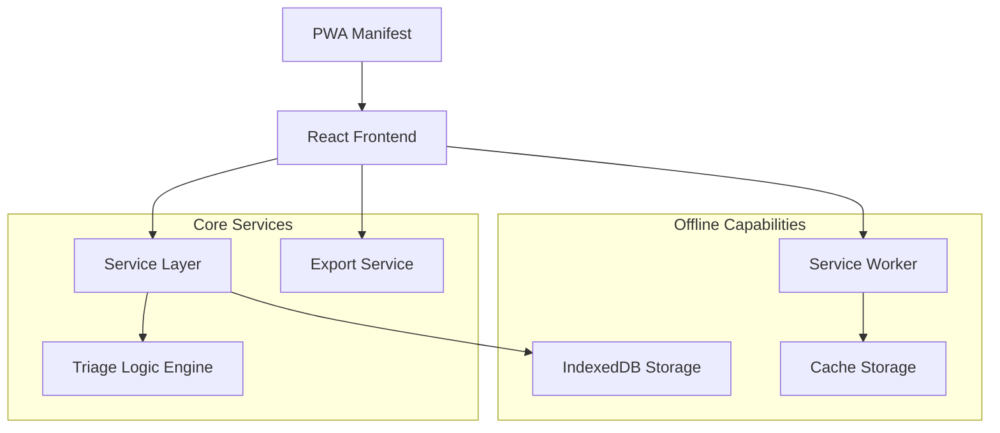

# Design Document

## Overview

The Offline-First Triage System is a Progressive Web Application (PWA) built with React, TypeScript, and Tailwind CSS. The system provides a complete offline-capable solution for medical triage in crisis zones, featuring local data storage, automatic triage classification, and data export capabilities. The architecture prioritizes simplicity, performance, and reliability to ensure functionality on low-specification devices in challenging environments.

## Architecture

### High-Level Architecture



### Technology Stack

- **Frontend Framework**: React 18 with TypeScript for type safety and component-based architecture
- **Styling**: Tailwind CSS for rapid, consistent UI development
- **Build Tool**: Vite for fast development and optimized production builds
- **Offline Storage**: IndexedDB via Dexie.js for structured local data persistence
- **PWA Features**: Service Workers for caching and offline functionality
- **State Management**: React hooks for local component state (no external state management needed for MVP)

### Deployment Architecture

- **Development**: Local Vite dev server
- **Production**: Static file deployment to CDN or local server
- **Crisis Zone Deployment**: Portable deployment via USB drive with local HTTP server

## Components and Interfaces

### Core Components

#### 1. PatientForm Component
**Purpose**: Collect patient information with minimal typing requirements

**Props Interface**:
```typescript
interface PatientFormProps {
  onPatientAdded?: () => void;
}
```

**Key Features**:
- Dropdown/checkbox-based symptom selection
- Minimal required fields (name, age, symptoms, condition)
- Form validation and auto-clearing
- Immediate triage level assignment

#### 2. TriageDashboard Component
**Purpose**: Display prioritized patient queue with color coding

**Props Interface**:
```typescript
interface TriageDashboardProps {
  refreshInterval?: number;
}
```

**Key Features**:
- Real-time patient queue display
- Color-coded triage levels (Red/Yellow/Green)
- Auto-refresh functionality
- Responsive grid layout

#### 3. TriageCard Component
**Purpose**: Individual patient display with triage information

**Props Interface**:
```typescript
interface TriageCardProps {
  patient: Patient;
  onClick?: (patient: Patient) => void;
}
```

**Key Features**:
- Color-coded background based on triage level
- Complete patient information display
- Accessible design with proper contrast

#### 4. ExportButton Component
**Purpose**: Generate and download CSV exports

**Props Interface**:
```typescript
interface ExportButtonProps {
  filename?: string;
}
```

**Key Features**:
- CSV generation from IndexedDB data
- Automatic file download
- Timestamped filenames

#### 5. OfflineStatusIndicator Component
**Purpose**: Display current connectivity status

**Key Features**:
- Real-time online/offline detection
- Visual status indicator
- Network event listeners

### Service Layer Interfaces

#### Storage Service
```typescript
interface StorageService {
  addPatient(patient: Omit<Patient, 'id' | 'timestamp'>): Promise<string>;
  getPatients(): Promise<Patient[]>;
  updatePatient(id: string, updates: Partial<Patient>): Promise<void>;
  deletePatient(id: string): Promise<void>;
}
```

#### Triage Logic Service
```typescript
interface TriageService {
  assignTriageLevel(symptoms: string[], condition: string): TriageLevel;
  getCriticalKeywords(): string[];
  getUrgentKeywords(): string[];
}
```

#### Export Service
```typescript
interface ExportService {
  exportToCSV(): Promise<string>;
  exportToJSON(): Promise<string>;
  downloadFile(content: string, filename: string, mimeType: string): void;
}
```

## Data Models

### Patient Model
```typescript
interface Patient {
  id: string;                    // UUID generated client-side
  name: string;                  // Patient full name
  age: number;                   // Patient age in years
  symptoms: string[];            // Array of selected symptoms
  condition: string;             // Additional condition notes
  triageLevel: TriageLevel;      // Assigned triage classification
  timestamp: number;             // Creation timestamp (Unix)
}

type TriageLevel = 'Critical' | 'Urgent' | 'Stable';
```

### Database Schema (IndexedDB)
```typescript
interface TriageDatabase extends Dexie {
  patients: Table<Patient>;
}

// IndexedDB Schema
const schema = {
  patients: 'id, name, age, symptoms, condition, triageLevel, timestamp'
};
```

### Triage Classification Rules
```typescript
interface TriageRules {
  critical: {
    symptoms: string[];          // ['bleeding heavily', 'unconscious', 'fainting', 'severe pain']
    conditionKeywords: string[]; // ['critical', 'emergency']
  };
  urgent: {
    symptoms: string[];          // ['fever', 'vomiting', 'moderate pain']
    conditionKeywords: string[]; // ['urgent', 'priority']
  };
}
```

## Error Handling

### Storage Error Handling
- **IndexedDB Unavailable**: Fallback to localStorage with reduced functionality
- **Storage Quota Exceeded**: Implement data cleanup strategies and user notification
- **Corruption Detection**: Database version management and recovery procedures

### Network Error Handling
- **Service Worker Registration Failure**: Graceful degradation with notification
- **Cache Update Failures**: Retry mechanisms with exponential backoff
- **Export Download Failures**: Alternative save methods (copy to clipboard)

### User Input Error Handling
- **Form Validation**: Real-time validation with clear error messages
- **Invalid Data Types**: Type coercion and sanitization
- **Required Field Validation**: Prevent submission with incomplete data

### Error Reporting Strategy
```typescript
interface ErrorHandler {
  logError(error: Error, context: string): void;
  showUserError(message: string, severity: 'info' | 'warning' | 'error'): void;
  recoverFromError(error: Error): boolean;
}
```

## Testing Strategy

### Unit Testing
- **Components**: React Testing Library for component behavior
- **Services**: Jest for business logic and data operations
- **Utilities**: Pure function testing for triage logic and exports

### Integration Testing
- **Database Operations**: IndexedDB integration with mock data
- **Service Worker**: PWA functionality and caching behavior
- **Form Workflows**: End-to-end patient input and triage assignment

### Performance Testing
- **Low-Spec Device Simulation**: CPU throttling and memory constraints
- **Large Dataset Handling**: Performance with 1000+ patient records
- **Offline Functionality**: Complete offline operation validation

### Accessibility Testing
- **Screen Reader Compatibility**: ARIA labels and semantic HTML
- **Keyboard Navigation**: Full keyboard accessibility
- **Color Contrast**: WCAG 2.1 AA compliance
- **Touch Target Sizes**: Minimum 44x44px interactive elements

### Browser Compatibility Testing
- **Modern Browsers**: Chrome, Firefox, Safari, Edge (latest 2 versions)
- **Mobile Browsers**: iOS Safari, Chrome Mobile, Samsung Internet
- **PWA Features**: Installation, offline functionality, service workers

### Test Data Strategy
```typescript
const mockPatients: Patient[] = [
  {
    id: 'test-1',
    name: 'John Doe',
    age: 30,
    symptoms: ['bleeding heavily'],
    condition: 'Trauma wound',
    triageLevel: 'Critical',
    timestamp: Date.now()
  },
  {
    id: 'test-2',
    name: 'Jane Smith',
    age: 25,
    symptoms: ['fever', 'vomiting'],
    condition: 'Possible infection',
    triageLevel: 'Urgent',
    timestamp: Date.now()
  },
  {
    id: 'test-3',
    name: 'Ali Ahmed',
    age: 40,
    symptoms: ['mild cough'],
    condition: 'Routine check',
    triageLevel: 'Stable',
    timestamp: Date.now()
  }
];
```

## Performance Considerations

### Bundle Optimization
- **Tree Shaking**: Eliminate unused code with Vite's built-in optimization
- **Code Splitting**: Lazy load non-critical components
- **Asset Optimization**: Compress images and minimize CSS/JS bundles

### Runtime Performance
- **Virtual Scrolling**: Handle large patient lists efficiently
- **Debounced Updates**: Prevent excessive re-renders during rapid input
- **Memoization**: Cache expensive calculations and component renders

### Storage Optimization
- **Data Compression**: Compress large text fields before storage
- **Cleanup Strategies**: Automatic removal of old records based on configurable retention
- **Indexing**: Optimize IndexedDB queries with proper indexing

### Network Optimization
- **Service Worker Caching**: Aggressive caching of static assets
- **Background Sync**: Queue data for sync when connectivity returns
- **Compression**: Enable gzip/brotli compression for static assets

## Security Considerations

### Data Privacy
- **Local Storage Only**: No data transmission without explicit user action
- **Data Encryption**: Consider encrypting sensitive patient data at rest
- **Access Control**: No authentication required for MVP, but designed for future implementation

### Input Sanitization
- **XSS Prevention**: Sanitize all user inputs before storage and display
- **SQL Injection**: Not applicable (no SQL database), but validate IndexedDB inputs
- **File Upload Security**: Validate export file generation and downloads

### PWA Security
- **HTTPS Requirement**: Service workers require secure context
- **Content Security Policy**: Implement CSP headers for production deployment
- **Secure Headers**: Add security headers for production environments

## Deployment Strategy

### Development Environment
- **Local Development**: Vite dev server with hot module replacement
- **Testing**: Local HTTPS server for PWA feature testing
- **Mock Data**: Seeded test data for development and testing

### Production Deployment
- **Static Hosting**: Deploy to CDN (Netlify, Vercel) or static file server
- **Asset Optimization**: Minified and compressed static assets
- **Cache Headers**: Appropriate cache headers for static assets

### Crisis Zone Deployment
- **Portable Deployment**: USB drive with pre-built application
- **Local Server**: Simple HTTP server (Python, Node.js, or Nginx)
- **Offline Installation**: Complete offline functionality from first load

### Monitoring and Maintenance
- **Error Tracking**: Client-side error logging for debugging
- **Performance Monitoring**: Core Web Vitals tracking
- **Usage Analytics**: Privacy-respecting usage statistics (optional)